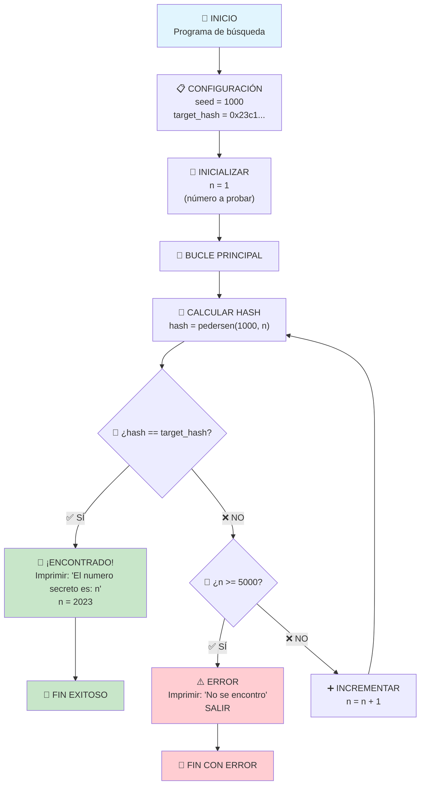

# 🔍 Búsqueda del Número Secreto con Hash Pedersen

> **Ejercicio Original**: [Starknet Security Challenge #5](https://starknet-security-challenges.app/cte22/challenge5)

Este proyecto implementa un algoritmo de búsqueda para encontrar un número secreto usando la función hash criptográfica Pedersen en Cairo.

## 🎯 Objetivo del Problema

Encontrar un número `n` tal que:

```
pedersen(1000, n) = 0x23c16a2a9adbcd4988f04bbc6bc6d90275cfc5a03fbe28a6a9a3070429acb96
```

**Datos conocidos:**

- `seed = 1000` (primer parámetro fijo)
- `target_hash = 0x23c16a2a9adbcd4988f04bbc6bc6d90275cfc5a03fbe28a6a9a3070429acb96` (hash objetivo)

**Incógnita:**

- `n = ?` (el número secreto a descubrir)

## ✅ Resultado

**🎉 El número secreto es: `2023`**

### Salida por Consola

```bash
$ scarb cairo-run
warn: `scarb cairo-run` will be deprecated soon
help: use `scarb execute` instead
   Compiling numero_secreto v0.1.0 (/home/alebeta/cairo_book/numero_secreto/Scarb.toml)
    Finished `dev` profile target(s) in 14 seconds
     Running numero_secreto
El numero secreto es: 2023
Run completed successfully, returning []
```

## 🔄 Flujo del Algoritmo



## 🔐 ¿Qué es Pedersen?

**Pedersen es una función hash criptográfica** que convierte dos números de entrada en un único hash de salida de manera segura y determinística.

### Características Principales:

1. **Función de Hash Criptográfica**:

   - Toma **2 entradas** (`a` y `b`)
   - Produce **1 salida** (hash único)
   - Es **determinística** (mismo input = mismo output)
   - Es **unidireccional** (difícil de revertir)

2. **Basada en Curvas Elípticas**:

   - Usa matemáticas de **curvas elípticas**
   - Seguridad basada en el **Problema del Logaritmo Discreto de Curva Elíptica (ECDLP)**
   - Muy difícil de "romper" o revertir

3. **Optimizada para Cairo/STARK**:
   - **Builtin nativo** en Cairo VM
   - Muy eficiente para pruebas zero-knowledge
   - Usado en Starknet para direcciones de storage

### Fórmula Matemática:

```
H(a, b) = [P₀ + a_low · P₁ + a_high · P₂ + b_low · P₃ + b_high · P₄]ₓ
```

Donde:

- `a_low`, `b_low` = 248 bits bajos de a y b
- `a_high`, `b_high` = 4 bits altos de a y b
- `P₀, P₁, P₂, P₃, P₄` = puntos constantes en la curva elíptica
- `[P]ₓ` = coordenada x del punto P

## 🧮 Lo que Realmente Sucede

### Proceso Paso a Paso:

1. **Inicialización:**

   ```cairo
   let seed = 1000;
   let target_hash = 0x23c16a2a9adbcd4988f04bbc6bc6d90275cfc5a03fbe28a6a9a3070429acb96;
   let mut n: u16 = 1;
   ```

2. **Búsqueda Sistemática:**

   ```
   n = 1:    pedersen(1000, 1)    ≠ target_hash
   n = 2:    pedersen(1000, 2)    ≠ target_hash
   n = 3:    pedersen(1000, 3)    ≠ target_hash
   ...
   n = 2022: pedersen(1000, 2022) ≠ target_hash
   n = 2023: pedersen(1000, 2023) == target_hash ✅ ¡ENCONTRADO!
   ```

3. **Verificación:**
   ```cairo
   // Cuando n = 2023:
   let hash = pedersen(1000, 2023);
   // hash = 0x23c16a2a9adbcd4988f04bbc6bc6d90275cfc5a03fbe28a6a9a3070429acb96
   // hash == target_hash ✅
   ```

### ¿Por qué 2023 NO es un parámetro?

**❌ Incorrecto:** "Pasamos 2023 como parámetro"
**✅ Correcto:** "2023 es el resultado que descubrimos"

- **2023 es la RESPUESTA**, no un dato de entrada
- El programa **busca** sistemáticamente hasta encontrar que `n = 2023`
- Solo conocíamos `seed = 1000` y `target_hash`

## 💻 Estructura del Código

```cairo
// Importar la función hash Pedersen
use core::pedersen::pedersen;

fn main() {
    // Datos conocidos del problema
    let seed = 1000;
    let target_hash = 0x23c16a2a9adbcd4988f04bbc6bc6d90275cfc5a03fbe28a6a9a3070429acb96;

    // Variable para la búsqueda
    let mut n: u16 = 1;

    // Algoritmo de búsqueda bruta
    loop {
        let hash = pedersen(seed, n.into());

        if hash == target_hash {
            println!("El numero secreto es: {}", n);
            return;
        }

        if n == 5000 {
            println!("No se encontro ningun numero valido.");
            return;
        }

        n += 1;
    }
}
```

## 📊 Análisis del Algoritmo

### Complejidad:

- **Tiempo**: O(n) donde n es el número secreto
- **Espacio**: O(1) memoria constante
- **Operaciones**: 2023 cálculos de hash Pedersen

### Estadísticas de Ejecución:

- **Intentos realizados**: 2023
- **Tiempo de compilación**: ~14 segundos
- **Operaciones Pedersen**: 2023
- **Gas consumido**: ~245 (en tests)

## 🚀 Cómo Ejecutar

### Prerrequisitos:

- [Scarb](https://docs.swmansion.com/scarb/) instalado
- Cairo configurado

### Comandos:

```bash
# Compilar el proyecto
scarb build

# Ejecutar el programa
scarb cairo-run
# o (recomendado)
scarb execute
```

## 🔧 Posibles Mejoras

1. **Búsqueda Binaria**: Si el rango fuera ordenado
2. **Paralelización**: Dividir el rango entre múltiples threads
3. **Optimización de Rango**: Empezar desde un número más cercano
4. **Cache de Resultados**: Guardar hashes calculados
5. **Búsqueda Probabilística**: Usar algoritmos más sofisticados

## 📚 Conceptos Aprendidos

- ✅ **Funciones Hash Criptográficas**: Pedersen y su uso en Cairo
- ✅ **Algoritmos de Búsqueda**: Fuerza bruta vs optimizaciones
- ✅ **Cairo Programming**: Builtins, tipos de datos, control de flujo
- ✅ **Criptografía**: Propiedades de las funciones hash unidireccionales
- ✅ **Zero-Knowledge**: Optimizaciones para pruebas STARK

## 🔗 Referencias

- [Ejercicio Original - Starknet Security Challenge #5](https://starknet-security-challenges.app/cte22/challenge5)
- [Documentación de Cairo](https://book.cairo-lang.org/)
- [Pedersen Hash en Starknet](https://docs.starknet.io/architecture-and-concepts/cryptography/)
- [Cairo Book - Working with Hashes](https://book.cairo-lang.org/ch12-04-hash.html)

---

**🎯 Resultado Final: El número secreto es `2023`**

_Este proyecto demuestra cómo resolver un problema criptográfico usando búsqueda exhaustiva en Cairo, encontrando el número que produce un hash Pedersen específico._
